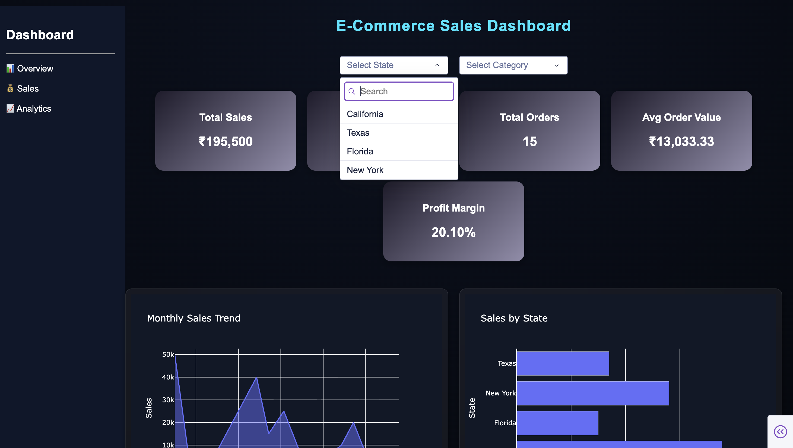
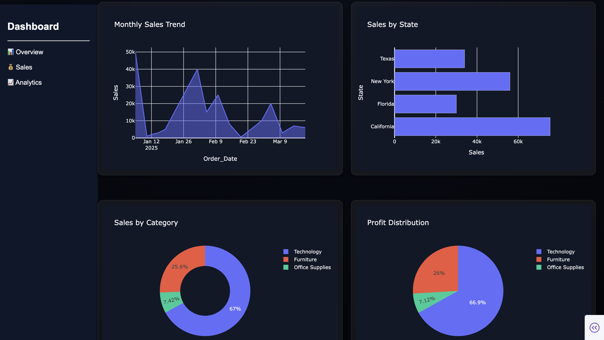
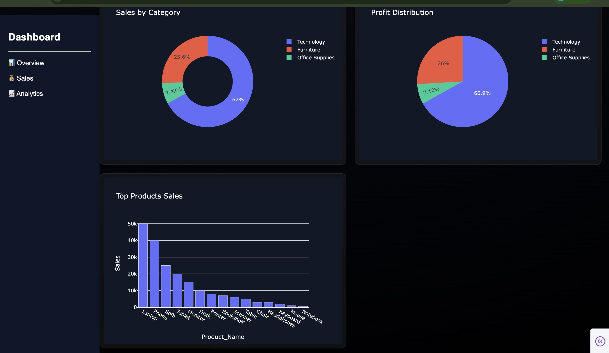

# E-Commerce Sales Dashboard

## Project Overview

This project is an interactive E-Commerce Sales Dashboard built using Python, Pandas, Dash, and Plotly.

The dashboard helps analyze business performance through sales, profit, orders, product performance, and category insights.

---

## 🚀 Features

- KPI Cards
  - Total Sales
  - Total Profit
  - Total Orders
  - Average Order Value
  - Profit Margin

- Interactive Filters
  - State Filter
  - Category Filter

- Data Visualizations
  - Area Chart (Monthly Sales Trend)
  - Horizontal Bar Chart (Sales by State)
  - Vertical Bar Chart (Top Products)
  - Donut Chart (Sales by Category)
  - Pie Chart (Profit Distribution)

---

## 🛠 Technologies Used

- Python
- Pandas
- Dash
- Plotly
- HTML
- CSS
- SQL

---

## 📂 Project Structure

```text
Ecommerce-sales-dashboard/
│
├── data/
│   └── sales.csv
│
├── python/
│   ├── analysis.py
│   └── dashboard.py
│
├── assets/
│   └── style.css
│
├── screenshots/
│
└── README.md
```

---

## 📊 Dashboard Screenshots

Add your screenshots below.

### Dashboard Home



### Dashboard Charts



### Dashboard Filters



---

## 🎯 Key Insights

- Technology category generated the highest sales.
- California contributed the highest revenue.
- Laptop and Phone products were top performers.
- Profit trends can be analyzed using interactive visualizations.

---

## 👨‍💻 Author

**Afrin Shaik**

Data Analytics & Web Development Enthusiast
